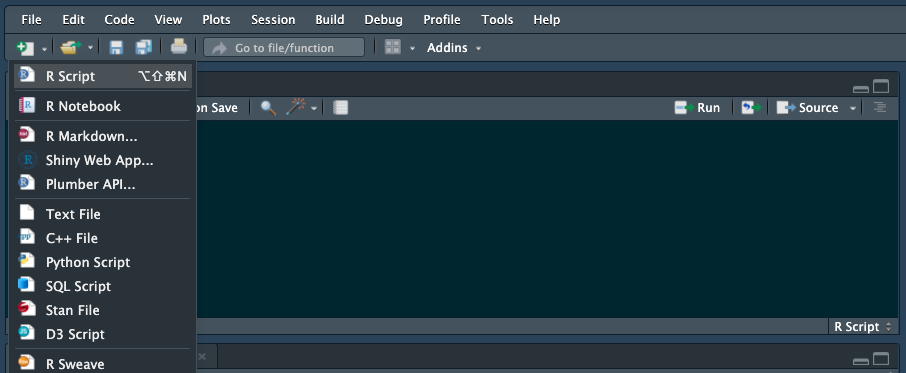

`Estadistica-Programacion-con-R` > [`Programacion con R`] > [`Sesion-03`] > [`Ejemplo-02`] 
### OBJETIVO 
- Generar un script en R con tareas complejas implementadas mediante funciones

#### REQUISITOS 
1. Contar con R studio.
1. Usar la carpeta de trabajo `Sesion03/Ejemplo-02`

#### DESARROLLO 
En esta sección vamos a crear varias funciones con tareas de programación intermedia.

Para esto hay que abrir el editor de scripts con un script nuevo:


Limpiamos el workspace como buena práctica de programación:
```{r}
rm(list=ls())
```
Vas a escribir una función llamada remainder, remainder() tomará dos argumentos: "num" y "divisor" donde "num" se divide por "divisor" y se devuelve el resto. Imagina que generalmente desea saber el residuo cuando se divide entre 2, por lo tanto, establece el valor predeterminado de "divisor" en 2 (por default del argumento). Asegurate de que "num" es el primer argumento y "divisor" es el segundo argumento.
Sugerencia # 1: puede utilizar el operador de módulo %% para encontrar el residuo.
Ej: 7 %% 4 se evalúa como 3.
```{r}
remainder <- function(num, divisor=2) {
  remainder <- num %% divisor
  # Recuerda: El valor de la última expresión evaluada es lo que se regresá (return)! 
}
```
Hagamos algunas pruebas de la función remainder(). Ejecute remainder(5) y vea qué sucede.
Tomemos un momento para examinar lo que acaba de suceder. Proporcionaste un argumento para la función, y R hizo coincidir ese argumento con 'num' ya que 'num' es el primer argumento. El valor predeterminado para 'divisor' es 2, por lo que la función utilizó el valor predeterminado que proporcionaste.

Ahora probemos la función remainder() proporcionando dos argumentos. Introduce en el prompt > remainder(11, 5) y veamos qué pasa.
```{r}
remainder(11,5)
```
También puedes especificar explícitamente argumentos en una función. Cuando designas explícitamente un argumento valores por nombre, el orden de los argumentos deja de ser importante. Puedes probar esto escribiendo: remainder(divisor = 11, num = 5).
Como puedes ver, hay una diferencia significativa entre remainder(11, 5) y remainder(divisor = 11, num = 5)!

Con toda esta charla sobre argumentos, puede que te preguntes si hay una manera de ver los argumentos de la función (además de mirar la documentación). Afortunadamente, puedes usar la funciín args(). Escribe: args(remainder) para examinar los argumentos de la función remainder.
